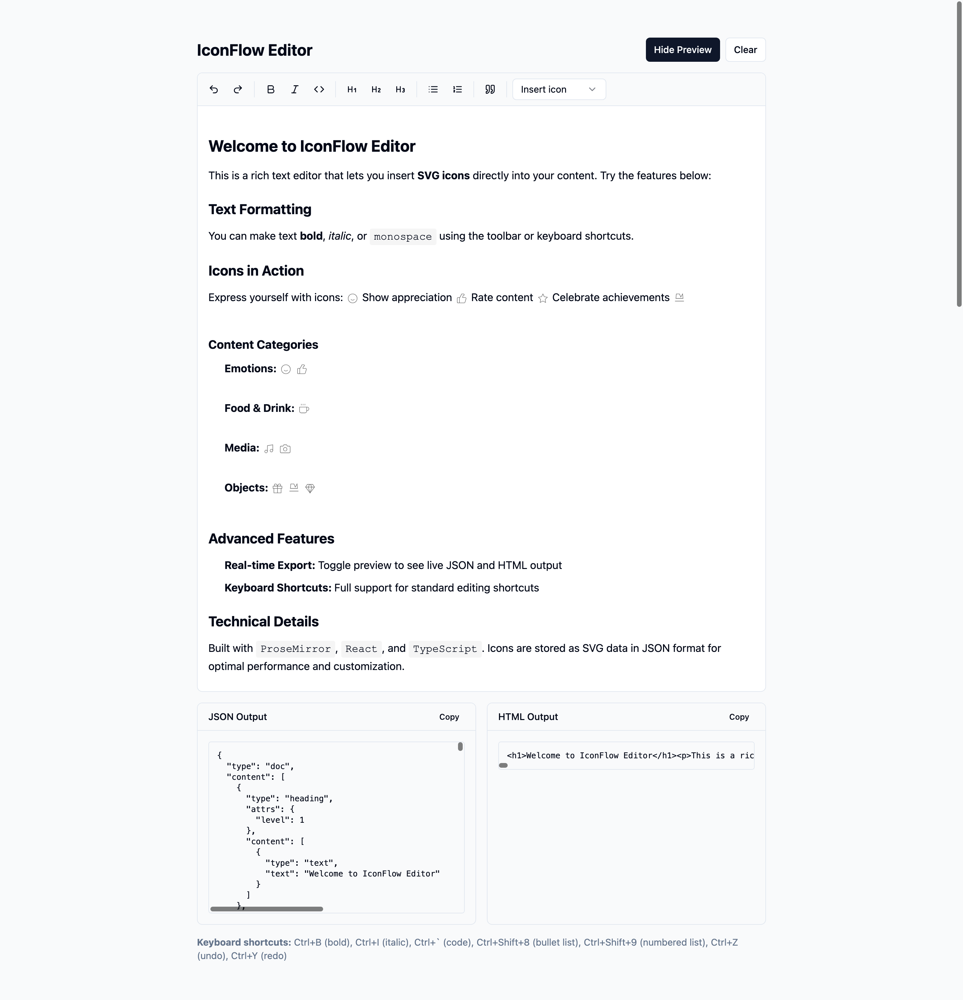

# ProseMirror Inline SVG Icon Poc

This project is a demonstration of inline SVG functionality with modern editor based on ProseMirror.

***Live Demo***: [https://icon-flow.vercel.app](https://icon-flow.vercel.app)

## Overview

A proof-of-concept showcasing how to integrate inline SVG icons within a ProseMirror-based editor, providing seamless icon insertion and rendering capabilities.



## Why SVG?

SVG icons offer several advantages for modern editors:

- **Freedom of choice**: Unlike emoji, SVGs offer infinite possibilities for custom designs and usage
- **Scalability**: Vector graphics remain crisp at any size
- **Customization**: Easy to modify colors, styles, and properties via CSS
- **Small file sizes**: Optimized SVGs are often smaller than raster images
- **Performance**: Inline SVGs reduce HTTP requests and can be cached efficiently

## Getting Started

### Installation

```bash
npm install
```

### Development

```bash
npm run dev
```

Open [http://localhost:3000](http://localhost:3000) with your browser to see the result.

### Build

```bash
npm run build
npm start
```

## Adding Icons

You can add custom icons by editing the `public/icons.json` file. Simply add your SVG markup to the JSON structure to make new icons available in the editor.
